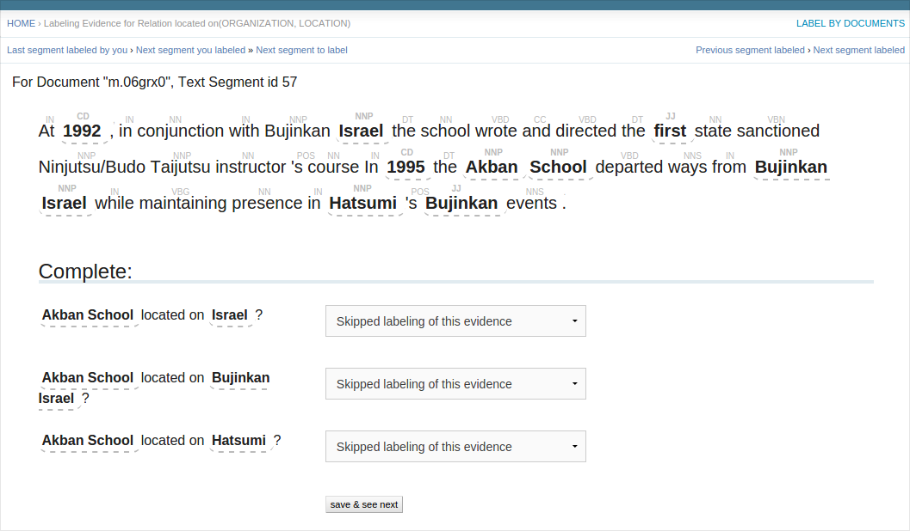
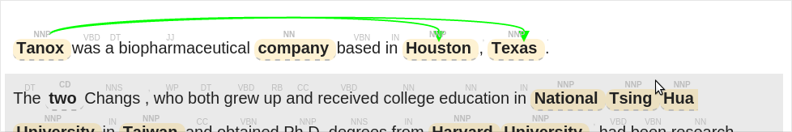
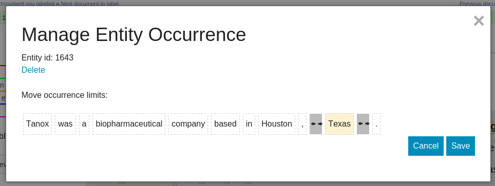

Creating a reference corpus
===========================

IEPY provides a web tool for creating a reference corpus in a simple and fast way. 
This corpus can be used for evaluation or simply to have a labeled corpus of 
relations between entity occurrences.

Running the web server
----------------------

First of all, you need to run the web server that will provide the interface.
This is done by running a *Django* server.

Assuming you have an iepy instance and it's your current directory,
to start the server you need to run 

.. code-block:: sh
    
    $ python bin/manage.py runserver

You will see a message like this:

::

    Starting development server at http://127.0.0.1:8000/
    Quit the server with CONTROL-C.

Home page
---------

At this point, you can go on and open a browser and access the URL `http://127.0.0.1:8000 <http://127.0.0.1:8000/>`_
and you will get a screen like this:

.. image:: home_screenshot.jpg

There are two different ways to label evidences: by segment and by document.

Segment based labeling
----------------------

When labeling by segment, you are presented with a segment of a document, and you will have to
answer if the relation is present on all the possible combinations of entity occurrences.

Here what you will need to do is complete every evidence whether the relation is present or not.
When saving you will get another segment to label and so on.

On top you have navigation controls and on the far right you have link to switch view 
for one by document.

Document based labeling
-----------------------

This view presents a complete document with all the segments that make sense to show. These are
the ones that have present entities with the entity kind that your relation uses.

.. image:: label_by_document_screenshot.png

On the left side of the page, you'll see a list of the options that you have to label the evidences.
To start labeling information what you need to do is choose one of this options, then click on two
entity occurrences (marked in yellow on the text).

IEPY will only let you click on entity occurrences that has the type that your relation need. Even
when you select the first entity occurrence, you will only be able to click on entities of the other
entity type.

After saving, IEPY will take you to automatically to the next document.
Also on top you have some navigation controls, but be careful with the following button because it won't
save the changes that you’ve made on this document. 

Fixing entities mistagged
-------------------------

It is possible that the automatic process that detects entities have been mistaken.
This leads to an entity tagged partially or incorrectly. In this case, we provide a tool to fix this problems.
You can access this tool by right clicking in the problematic entity. 

There you can completly remove the entity or change the limits so it holds more (or less) tokens.
